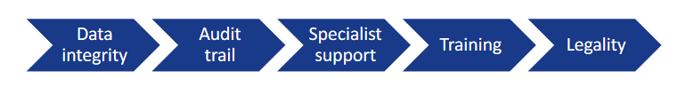
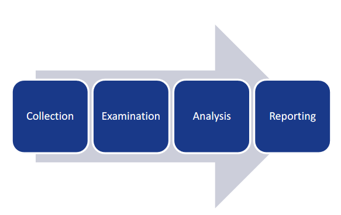

# Atelier Gestion des Incidents


## Cyberattaque au CHU de Rouen


Info: 1 min

https://www.youtube.com/watch?v=TqojSAQvCAs

Europe 1: 2 min

https://www.youtube.com/watch?v=OnoIzhajFvw

Directeur Hopital: 7 min 

https://www.youtube.com/watch?v=tJro-tSV0qs

Le Monde

https://www.lemonde.fr/pixels/article/2019/11/18/frappe-par-une-cyberattaque-massive-le-chu-de-rouen-force-de-tourner-sans-ordinateurs_6019650_4408996.html


Que s'est-il passé ?

Comment l'hopital a-t-il réagit ?

Quelles sont les conséquences pour les médecins, les patients ?

Quels messages veut faire passer le DSI ?


## Cyberattaque d'une PME 

 
Envoyé spécial: 30 min

https://www.youtube.com/watch?v=JrFoFBNfv7A

Quelles différences avec le cas de l'hopital ?

Quel conséquence pour la PME ?


## Etre prêts: 

- Avoir anticipé le pire 

- Gérer l'incident en temps réel, continuer de fonctionner
  
- Plan de reprise d'activité, remettre dans les applis ce qui a été fait à la main 

- Analyse à froid, comprendre, éviter que ça recommence, aller au tribunal avec des preuves


Le role des process, des SOC, des formations 

L'ANNSI 

https://www.ssi.gouv.fr/


L'ENISA 

https://www.enisa.europa.eu


## Atelier Forensics 

Comprendre pour anticiper ce qui va se passer 


### Process forensic 




- Data integrity: Ne rien faire qui puisse invalider une preuve au tribunal
- Audit trail: On trace TOUT ce qui est fait sur les preuves 
- Specialist support: Toute preuve doit être notifée à un expert.
- Appropriate training: Les intervnants de premier niveau doivent être formés
- Legality: Le responsable doit s'assurer que tout est fait dansun cadre légal


- Obtain information
- Strategize
- Collect evidence
- Analyse
- Report


### Analyse d'un disque 

- Faire une copie du disque avec une interface lecture seule [https://en.wikipedia.org/wiki/Forensic_disk_controller]
- Travailler sur une copie de la copie 

- Analyser le disque (format, partitions)
- Monter le disk en lecture seule 
- Analyser le contenu existant
- Chercher les fichiers effacés 

Images de disque
- [datas/usb1.img](./datas/usb1.img)
- [datas/usb2.img](./datas/usb2.img)

Outils:
- file 
- mount / umount 
- photorec  

References:
(https://tldp.org/LDP/sag/html/partitions.html)


### Analyse d'une trace réseau: Exfiltration de données  


- (/datas/exfiltration_dns.pcap)(/datas/exfiltration_dns.pcap) Exfiltration DNS
- (/datas/exfiltration_ping.pcap)(/datas/exfiltration_dns.pcap) Exfiltration Ping
 
 
Outils
- wireshark 
- tshark 
- python 

Extraction de champs:
```
tshark -nr cap.pcap -Y "dns.flags.response == 0" -T fields -e dns.qry.name
```

Filtrer les protocoles 
```
tshark -r exfiltration.pcap |awk '{print $6}' |sort -u
```

Domaines de requete DNS 
```
tshark -r exfiltration.pcap -Y 'dns' -Tfields -e dns.qry.name |sort -u
```

Ping
```
tshark -r exfiltration.pcap -Y 'icmp'
```


### Analyse de logs: Bruteforce sql d'une base de données 

- Système de collecte de logs centralisé
- Time stamps 
- CRC 

Se créer un compte sur root me. 
Etudier le chall: (https://www.root-me.org/fr/Challenges/Forensic/Analyse-de-logs-attaque-web)
- (datas/ch13.txt)


 


